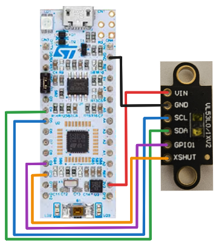

# Example with Nucleo-L432KC board

Example project using NUCLEO-L432KC board.

## HOW-TO Use Example Code

- Overwrite the `ChibiOS`-folder with the ChibiOS repository.
- Move the `vl53l1x_uld`-folder and the `libs.mk`-file to the `libs`-folder.
- No changes to the `Makefile`. It is already predefined for `libs`-folder and the `libs.mk`-file.
- It is now ready to be compiled and loaded onto a Nucleo-l432KC board.

## Wire up VL53L1X module

The NUCLEO-L432KC Pinout:

| VL53L1X Module Pin | STM32F401RE Pin | NUCLEO64-F401RE Arduino Connector Pin | Function |
| --- | --- | --- | --- |
| VIN | - | 3V3 | 3.3V power source |
| GND | - | GND | Ground |
| SCL | PB6 | D5 | Serial Clock Line for I2C1 |
| SDA | PB7 | D4 | Serial Data (Line) for I2C1 |
| GPIO1 | PA8 | D9 | Configurable pin (Interrupt Pin?) |
| XSHUT | PA11 | D10 | Active-low Shutdown Pin. LOW (GND) Shutdown; HIGH (VIN) Active/enabled |

## Useful Links

- NUCLEO-L432KC Board: https://www.st.com/en/evaluation-tools/nucleo-l432kc.html
- STM32L432KC Chip: https://www.st.com/en/microcontrollers-microprocessors/stm32l432kc.html
- STM32L4 series SVD files: https://www.st.com/en/microcontrollers-microprocessors/stm32-ultra-low-power-mcus.html#cad-resources
- ChibiOS Demo for the board: https://github.com/ChibiOS/ChibiOS/tree/master/demos/STM32/RT-STM32L432KC-NUCLEO32

